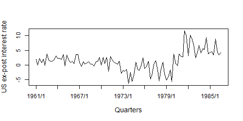

# `bmcp`
R package for the Normal data application of the Bayesian multipartition change point model introduced in [Pedroso et al (2020)](https://arxiv.org/abs/2107.11456).

# Install
To install `bmcp`, consider the code

```R
install.packages("devtools")
devtools::install_github("rcpedroso/bmcp")
```
If installation fails, please report the problem to ricardocunhap@gmail.com. Any other problems or comments can also be reported!

# Code example
### Case study 1 of [Pedroso et al (2020)](https://arxiv.org/abs/2107.11456)

```R
### loading required packages
require(bmcp)
require(bcp)
require(MCMCvis)
require(ggplot2)
require(calibrate)
require(dplyr)


### data
data(RealInt) # available in bcp package
Y <- as.vector(RealInt)
Yt <- as.vector(time(RealInt))
Ytq <- paste0(Yt,"/",((Yt-floor(Yt))+.25)/.25)
n = length(Y)

plot(y=Y, x=Yt, type="l", xaxt="n", cex.lab=1.2,
     xlab="Quarters", ylab="US ex-post interest rate")
axis(1, at=Yt[seq(1,n,12)], labels=Ytq[seq(1,n,12)], cex.axis=1)

```




